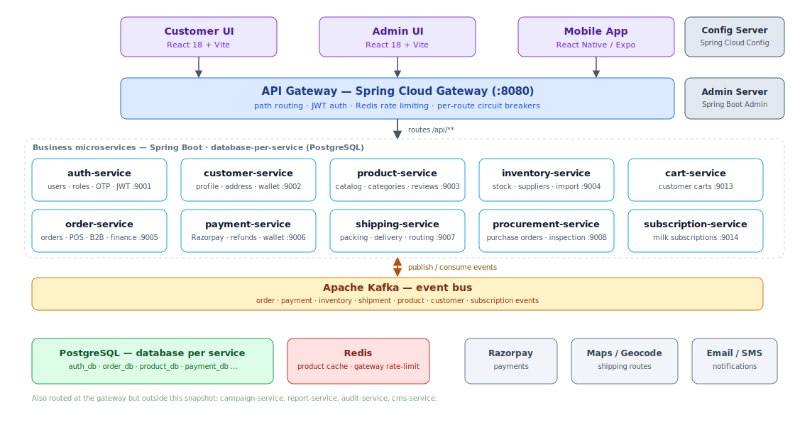
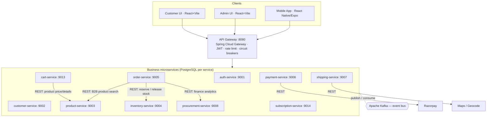

# E-commerce — Service Architecture

A single-company online grocery store (organic groceries, fruits and vegetables) selling to many customers.
The backend is a set of Spring Boot microservices behind a Spring Cloud Gateway. Services talk to each other
**synchronously over REST (Feign)** where a request needs an immediate answer, and **asynchronously over Apache
Kafka** for domain events. Each service owns its own **PostgreSQL** database (database-per-service).

This document describes the services that are actually in the codebase — their real ports, endpoints and events.

## Service map

Diagram source (Mermaid)

## Clients

| App                 | Folder             | Stack                        |
|---------------------|--------------------|------------------------------|
| Customer storefront | `customer-ui`      | React 18 + Vite + TypeScript |
| Admin portal        | `admin-ui`         | React 18 + Vite + TypeScript |
| Mobile app          | `mobile-app`       | React Native (Expo)          |

## Platform / infrastructure services

- **API Gateway** (`api-gateway`, :8080) — the single entry point. Routes `/api/**` to each service, verifies
  JWTs, applies Redis-backed rate limiting and a per-route circuit breaker with a `/fallback` handler.
- **Config Server** (`config-server`) — Spring Cloud Config, serving each service's config from `config-repo`.
- **Spring Boot Admin server** (`spring-admin-server`) — health and metrics monitoring across services.

## Business services & responsibilities

Only what each service actually does, with representative real endpoints.

| Service (port)                   | Owns (entities)                                                         | Responsibilities & representative endpoints                                                                                                                                                                                                                                                                 |
|----------------------------------|-------------------------------------------------------------------------|-------------------------------------------------------------------------------------------------------------------------------------------------------------------------------------------------------------------------------------------------------------------------------------------------------------|
| **auth-service** (:9001)         | User, Role, RefreshToken, OtpRecord                                     | Registration, login, JWT + refresh/logout, OTP send/verify, forgot/reset password; admin user & role management. `/auth/register`, `/auth/login`, `/auth/refresh`, `/auth/otp/send`, `/auth/users/{id}/roles`                                                                                               |
| **customer-service** (:9002)     | Customer, Address, Wallet, WalletTransaction                            | Customer profile, saved addresses, wallet credit/debit, free-delivery flags; admin customer list & export. `/customers/me`, `/addresses`, `/wallet`, `/api/admin/customers/{id}/wallet/credit`                                                                                                              |
| **product-service** (:9003)      | Product, Category, ProductReview, ProductImportJob                      | Product catalog, category tree, product reviews, image upload, bulk & GST import, Redis-cached listings. `/products/search`, `/products/featured`, `/categories/tree`, `/api/admin/products/bulk-import`, `/products/{id}/reviews`                                                                          |
| **inventory-service** (:9004)    | InventoryItem, Supplier, PurchaseHistory, InventoryImportJob, DumpEntry | Stock levels, reserve/release, stock-out & thresholds, suppliers, purchase price history, inventory import jobs, sourcing dump. `/inventory/reserve`, `/inventory/release`, `/inventory/check/{productId}`, `/api/admin/suppliers`                                                                          |
| **cart-service** (:9013)         | Cart, CartItem (PostgreSQL `cart_db`)                                   | Customer carts — add/update/remove items, clear cart, product price/detail lookup via product-service. `/cart/items`, `/cart/items/{itemId}`, `/cart/clear`                                                                                                                                                 |
| **order-service** (:9005)        | Order, OrderItem, B2bUpload, B2bProductMapping/Price                    | Order creation & lifecycle, cancellation, in-store POS orders, B2B bulk uploads & invoicing, finance analytics, sales/finance reports, dashboard stats. `/orders/my`, `/orders/{id}/cancel`, `/api/admin/pos`, `/api/admin/b2b-uploads`, `/api/admin/finance/dashboard/summary`, `/api/admin/reports/sales` |
| **payment-service** (:9006)      | Payment, PaymentRefund                                                  | Razorpay integration (initiate / verify / webhook), refunds, COD mark-collected, wallet; admin payment stats. `/payments/initiate`, `/payments/verify`, `/payments/webhook`, `/api/admin/payments/{orderId}/refund`                                                                                         |
| **shipping-service** (:9007)     | Shipment, PackingItem, DeliveryBoy, DeliveryDaysConfig                  | Fulfilment lifecycle (packed → dispatched → out-for-delivery → delivered), packing, invoices, delivery-boy roster & assignment, geocode/route planning, delivery-day config. `/api/admin/shipping/{orderId}/dispatch`, `/api/admin/shipping/delivery-boys/assign`, `/api/admin/shipping/route`              |
| **procurement-service** (:9008)  | ProcurementOrder, ProcurementItem, StoreInventoryItem                   | Purchase orders to suppliers, store inventory, material & quality inspection, transfer of received stock into inventory. `/api/admin/procurement`, `/api/admin/procurement/{id}/store-items`, `/store-items/{id}/quality-inspection`                                                                        |
| **subscription-service** (:9014) | Subscription, SubscriptionDayLog                                        | Recurring milk subscriptions — initiate/verify, pause/resume/cancel, per-day delivery logs, delivery report. `/subscriptions/initiate`, `/subscriptions/{id}/pause`, `/api/admin/subscriptions/delivery-report`                                                                                             |

## Synchronous communication (REST / Feign)

- All clients → **API Gateway**, which routes to each service and enforces JWT auth, rate limiting and circuit breaking.
- **cart-service → product-service** (`ProductClient`) — product price and details for cart items.
- **order-service → inventory-service** (`InventoryClient`) — `POST /inventory/reserve` and `/inventory/release`.
- **order-service → product-service** (`ProductSearchClient`) — product lookup for B2B upload mapping.
- **order-service → procurement-service / inventory-service** (finance clients) — aggregating finance analytics.
- **payment-service → Razorpay** — order creation, capture and refunds.
- **shipping-service → Maps/Geocoding** — `/geocode` and `/route` for delivery planning.

## Asynchronous communication (Kafka events)

Each service publishes events about its own domain; consumers react by updating **their own** data. The table
below lists, for every event, the service that **produces** it, the service(s) that **consume** it, and exactly
what the consumer does on consume — taken from the producing service's publisher and the consumer's
`@KafkaListener` handlers. Rows are grouped by producer.

| Producer                | Event                       | Consumer            | Action performed on consume                                                                                                                                          |
|-------------------------|-----------------------------|---------------------|----------------------------------------------------------------------------------------------------------------------------------------------------------------------|
| **order-service**       | `order-placed`              | payment-service     | Creates a `Payment` record; resolves method (COD / WALLET / ONLINE) and order source; COD & wallet skip gateway initiation. Idempotent against duplicate deliveries. |
|                         | `order-placed`              | shipping-service    | Creates a `Shipment` with packing items and an address snapshot.                                                                                                     |
|                         | `order-placed`              | customer-service    | Increments the customer's order count.                                                                                                                               |
|                         | `order-confirmed`           | shipping-service    | Moves the shipment → `PACKING`.                                                                                                                                      |
|                         | `order-cancelled`           | payment-service     | If not yet paid → marks the payment `CANCELLED`; if already `PAID` → flags that a refund is required (admin or auto-refund).                                         |
|                         | `order-cancelled`           | shipping-service    | Cancels the shipment if it has not yet been dispatched.                                                                                                              |
|                         | `order-cancelled`           | inventory-service   | Restores (releases) stock for the cancelled order's items.                                                                                                           |
|                         | `order-fulfilled`           | shipping-service    | Syncs the shipment → `DISPATCHED`.                                                                                                                                   |
|                         | `order-fulfilled`           | inventory-service   | No-op — stock is already deducted at order placement.                                                                                                                |
|                         | `order-completed`           | shipping-service    | Syncs the shipment → `DELIVERED`.                                                                                                                                    |
|                         | `order-completed`           | customer-service    | Updates average order value & preferred payment method.                                                                                                              |
| **payment-service**     | `payment-order-paid`        | order-service       | Sets order `paymentStatus = PAID`; emails payment-success to the customer.                                                                                           |
|                         | `payment-order-failed`      | order-service       | Sets order `paymentStatus = FAILED`; emails payment-failed to the customer.                                                                                          |
|                         | `payment-order-refunded`    | order-service       | Sets order `paymentStatus = REFUNDED`.                                                                                                                               |
|                         | `payment-wallet-credited`   | customer-service    | Credits the customer's wallet.                                                                                                                                       |
|                         | `payment-wallet-debited`    | customer-service    | Debits the customer's wallet.                                                                                                                                        |
| **shipping-service**    | `shipment-packing`          | order-service       | Advances order status → `PACKING`.                                                                                                                                   |
|                         | `shipment-dispatched`       | order-service       | Advances order status → `SHIPPED`; syncs the assigned delivery boy.                                                                                                  |
|                         | `shipment-out-for-delivery` | order-service       | Advances order status → `OUT_FOR_DELIVERY`.                                                                                                                          |
|                         | `shipment-delivered`        | order-service       | Advances order status → `DELIVERED`.                                                                                                                                 |
|                         | `shipment-assigned`         | order-service       | Updates only the delivery-boy fields on the order.                                                                                                                   |
| **product-service**     | `product-created`           | inventory-service   | Creates an `InventoryItem` (when `manageInventory = true`).                                                                                                          |
|                         | `product-updated`           | inventory-service   | Syncs denormalized fields (name, brand, SKU, unit, active, manageInventory).                                                                                         |
|                         | `product-deleted`           | inventory-service   | Deactivates the `InventoryItem`.                                                                                                                                     |
| **inventory-service**   | `inventory-updated`         | product-service     | Updates the product's stock quantity & `inStock` flag from sellable qty (quantity − reserved).                                                                       |
|                         | `inventory-low-stock`       | procurement-service | Auto-creates a `LOW_STOCK` procurement (purchase) order, reorder qty ≈ 2× threshold.                                                                                 |
| **procurement-service** | `stock-transferred`         | inventory-service   | Applies the transfer — adds the received quantity & unit cost into sellable inventory.                                                                               |
| **auth-service**        | `user-registered`           | customer-service    | Creates the `Customer` profile from the auth event.                                                                                                                  |

Stock reservation/deduction at checkout is **synchronous** (order-service → inventory `POST /inventory/reserve`),
not event-driven. Additional events are published for audit/analytics only (e.g. auth `login-success` /
`login-failed` / `otp-requested`, `customer-*`, `subscription-*`, `cart-updated` / `cart-cleared`,
`inventory-out-of-stock`). Because consumers react independently, a slow or failed downstream service never
blocks order intake.

## Cross-cutting

- **Database-per-service (PostgreSQL):** `auth_db`, `customer_db`, `product_db`, `inventory_db`, `order_db`,
  `payment_db`, `shipping_db`, `procurement_db`, `cart_db`, `subscription_db`.
- **Redis:** product-service (catalog cache) and the API gateway (rate limiting).
- **Resilience:** per-route circuit breakers with a gateway `/fallback`.

> **Scope note:** the gateway/config also reference `campaign-service`, `report-service`, `audit-service` and
> `cms-service` (ports 9009–9011, with databases provisioned), but their source is not part of this snapshot,
> so they are omitted from the service map.

See the [order flow sequence diagram](../flows/ecommerce-order-flow.md).
