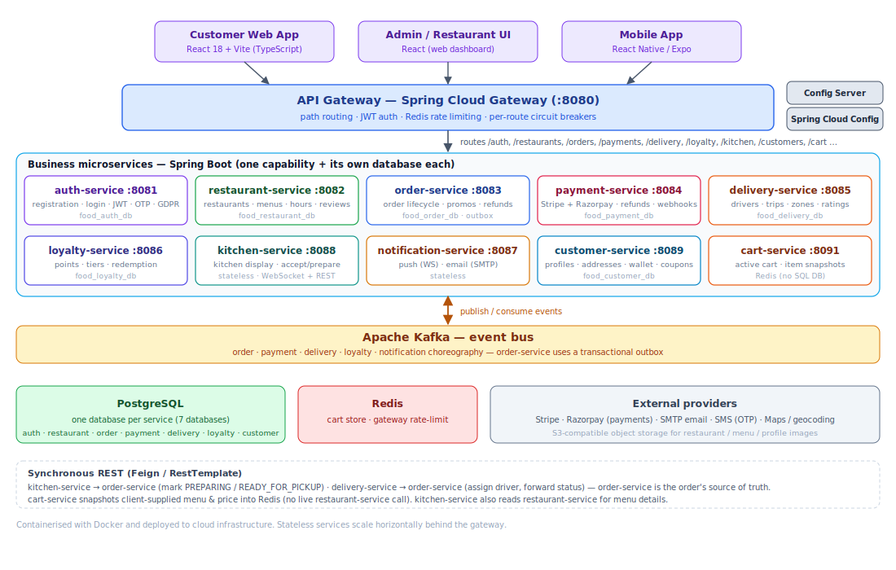

# Food Ordering — Service Architecture

A multi-restaurant food-delivery platform for the German market. Customers browse nearby restaurants and
menus, place and pay for orders, and track them in near real time from *confirmed → preparing → ready →
out for delivery → delivered*. Restaurant owners manage menus and orders on a kitchen display; drivers claim
and fulfil deliveries.

The backend is a set of Spring Boot microservices behind a Spring Cloud Gateway. Services talk to each other
**synchronously over REST** where a request needs an immediate answer, and **asynchronously over Apache Kafka**
for domain events. Each stateful service owns its own **PostgreSQL** database (database-per-service); the cart
lives in **Redis** and two services hold no database of their own.

This document describes the services that are actually in the codebase — their real ports, gateway routes and events.

## Service map



<details>
<summary>Diagram source (Mermaid)</summary>

```mermaid
flowchart TB
    subgraph Clients
        CU["Customer Web App · React 18 + Vite"]
        AU["Admin / Restaurant UI · React + Vite"]
        MOB["Mobile App · React Native / Expo"]
    end

    GW["API Gateway :8080<br/>Spring Cloud Gateway · JWT · Redis rate limit · circuit breakers"]
    CFG["Config Server · Spring Cloud Config"]

    subgraph Services["Business microservices (PostgreSQL per service)"]
        AUTH["auth-service :8081"]
        REST["restaurant-service :8082"]
        ORD["order-service :8083"]
        PAY["payment-service :8084<br/>Stripe + Razorpay"]
        DEL["delivery-service :8085"]
        LOY["loyalty-service :8086"]
        NOTIF["notification-service :8087<br/>stateless"]
        KIT["kitchen-service :8088<br/>stateless · WS + REST"]
        CUST["customer-service :8089"]
        CART["cart-service :8091<br/>Redis · no SQL DB"]
    end

    KAFKA{{"Apache Kafka — event bus"}}

    CU --> GW
    AU --> GW
    MOB --> GW
    GW --> Services
    GW -.config.- CFG

    KIT -->|REST: PATCH/POST /orders/{id}/status| ORD
    DEL -->|REST: PUT /orders/{id}/assign| ORD

    Services -.publish / consume.- KAFKA
```
</details>

## Clients

| App | Folder | Stack |
|---|---|---|
| Customer storefront | `food-order-ui` | React 18 + Vite + TypeScript |
| Admin / restaurant portal | `food-order-admin-ui` | React 18 + Vite + TypeScript |
| Mobile app | `food-order-mobile-ui` | React Native (Expo) + TypeScript |

## Platform / infrastructure services

- **API Gateway** (`api-gateway`, :8080) — the single entry point. Routes each path prefix to its service,
  verifies JWTs, applies Redis-backed rate limiting and per-route circuit breakers with a `/fallback` handler.
- **Config Server** (`config-server`) — Spring Cloud Config, serving each service's configuration from `config-repo`.

## Business services & responsibilities

Only what each service actually does, with its real gateway route prefixes. Primary keys are UUIDs throughout;
there is no shared base entity — each service owns its own schema.

| Service (port) | Database | Owns (entities) | Responsibilities & gateway routes |
|---|---|---|---|
| **auth-service** (:8081) | `food_auth_db` | User | Registration, login, JWT, OTP, GDPR deletion; roles `CUSTOMER` / `RESTAURANT_OWNER` / `DRIVER` / `ADMIN` / `SUPPORT`; `preferred_language` de/en/tr. On register, publishes `food.user.registered`. Routes `/auth/**`, `/admin/users/**` |
| **restaurant-service** (:8082) | `food_restaurant_db` | RestaurantOwner, Restaurant, MenuCategory, MenuItem, RestaurantHours, RestaurantReview, TableReservation | Restaurants, multilingual menus (en/de/tr), weekly hours, reviews, dine-in reservations, QR. Publishes via transactional **outbox**. Routes `/restaurants/**`, `/owners/**`, `/menus/**`, `/tables/**`, `/qr/**`, `/admin/restaurants/**`, `/admin/menu-items/**` |
| **order-service** (:8083) | `food_order_db` | Order, OrderItem, OrderStatusHistory, Promotion, PromoUsage, RefundRequest | Order creation & full status lifecycle, promos/discounts, customer refund requests, status history. Source of truth for the order. Publishes via transactional **outbox**. Routes `/orders/**`, `/promotions/**`, `/admin/orders/**` |
| **payment-service** (:8084) | `food_payment_db` | Payment, Refund, PaymentEvent | **Two gateways — Stripe and Razorpay** — plus COD and wallet; refunds, idempotency keys, raw webhook storage, wallet top-ups; admin finance. Currency EUR. Routes `/payments/**`, `/admin/finance/**` |
| **delivery-service** (:8085) | `food_delivery_db` | Driver, DriverDelivery, DriverRating, DeliveryZone | Driver profiles, live location, trip lifecycle (`ACCEPTED → ARRIVED_PICKUP → PICKED_UP → DELIVERED`), ratings, per-restaurant delivery zones. Routes `/delivery/**`, `/drivers/**`, `/driver-profiles/**`, `/admin/drivers/**` |
| **loyalty-service** (:8086) | `food_loyalty_db` | LoyaltyAccount, LoyaltyTransaction | Points and tiers (`BRONZE`/`SILVER`/`GOLD`/`PLATINUM`); earns on delivery, deducts on refund. Route `/loyalty/**` |
| **notification-service** (:8087) | *(stateless)* | — | WebSocket push (kitchen, customer, order-tracking topics) and email (SMTP); reacts to order, delivery and driver-location events. Routes `/notifications/**`, `/ws/**` |
| **kitchen-service** (:8088) | *(stateless)* | — | Restaurant kitchen display over WebSocket; accept/prepare/ready actions push order-status changes back to order-service over REST. Route `/kitchen/**` |
| **customer-service** (:8089) | `food_customer_db` | Customer, CustomerAddress, CustomerWallet, WalletTransaction, Coupon, CustomerCoupon | Customer profiles (auto-created from `food.user.registered`), addresses, wallet, coupons. Routes `/customers/**`, `/admin/profiles/**` |
| **cart-service** (:8091) | *(Redis)* | Cart, CartItem *(Redis)* | Active cart keyed by user ID; item rows snapshot client-supplied menu-item, price and restaurant so the cart renders without a live restaurant-service call; adding from a different restaurant clears the cart. Route `/cart/**` |

## Synchronous communication (REST)

- All clients → **API Gateway**, which routes to each service and enforces JWT auth, rate limiting and circuit breaking.
- **kitchen-service → order-service** — `POST /orders/{id}/status?status=…`: when a restaurant accepts and
  advances an order on the kitchen display (`CONFIRMED` → `PREPARING` → `READY_FOR_PICKUP`), kitchen-service
  calls order-service, which remains the source of truth for the order.
- **delivery-service → order-service** — `PUT /orders/{id}/assign`: on driver assignment, delivery-service
  attaches the driver to the order (reverting the driver to `AVAILABLE` if order-service is unreachable).
- **cart-service** makes no cross-service REST call — it trusts the client-supplied menu/price snapshot held in Redis.

## Asynchronous communication (Kafka events)

Each service publishes events about its own domain; consumers react by updating **their own** data. `order-service`
and `restaurant-service` publish through a transactional **outbox** (an `outbox_events` table drained by a poller),
so an event is never lost if Kafka is briefly down. The table below lists, for every event, the producer, the
consumer(s), and exactly what each consumer does on consume — taken from the producing code and the consumer's
`@KafkaListener` handlers. Rows are grouped by producer.

| Producer | Event | Consumer | Action performed on consume |
|---|---|---|---|
| **auth-service** | `food.user.registered` | customer-service | Auto-creates the `Customer` profile (roles `CUSTOMER` / `ADMIN`). |
| | `food.user.registered` | restaurant-service | Creates a `RestaurantOwner` when role is `RESTAURANT_OWNER`. |
| | `food.user.registered` | delivery-service | Creates a `Driver` (status `OFFLINE`) when role is `DRIVER`; idempotent per `user_id`. |
| | `food.user.gdpr.deletion` | customer-service | Purges the deleted user's profile images. |
| **order-service** *(outbox)* | `food.order.created` | payment-service | Creates a **pending COD** `Payment` when `paymentMethod = CASH_ON_DELIVERY` (idempotent); card/online orders pay via the gateway directly. |
| | `food.order.created` | kitchen-service | Pushes a `NEW_ORDER` card to the restaurant's kitchen display over WebSocket. |
| | `food.order.created` | notification-service | Notifies the restaurant (`NEW_ORDER`) and the customer (`ORDER_CONFIRMED`). |
| | `food.order.status.updated` | kitchen-service | Pushes `ORDER_STATUS_CHANGED` to the kitchen board for `CONFIRMED` / `CANCELLED`. |
| | `food.order.status.updated` | notification-service | WebSocket status push to the customer; email on `CONFIRMED` / `OUT_FOR_DELIVERY` / `DELIVERED`. |
| | `food.order.status.updated` | payment-service | On `CANCELLED`: auto Stripe refund if a card payment was already `CAPTURED`; just cancels the record if still `PENDING` / `PROCESSING`. |
| | `food.order.delivered` | loyalty-service | Awards `loyaltyPointsEarned` to the customer's account. |
| | `food.order.delivered` | payment-service | Marks the COD `Payment` as `CAPTURED` (cash collected on delivery). |
| | `food.order.items.refunded` | loyalty-service | Deducts `loyaltyPointsToDeduct` for the refunded items. |
| | `food.refund.approved` | payment-service | Executes the admin-approved refund on the gateway (idempotent per refund request). |
| **payment-service** | `food.payment.success` | order-service | Marks the order `PAID` and stores the payment-intent id (idempotent). Emitted by **both** the Stripe and Razorpay flows. |
| | `food.wallet.topup.success` | customer-service | Credits the customer's wallet from the top-up. |
| **delivery-service** | `food.delivery.driver.assigned` | notification-service | Pushes `DRIVER_ASSIGNED` to the order-tracking topic. |
| | `food.driver.location.updated` | notification-service | Broadcasts the driver's live location to order-tracking subscribers. |

A few events are published for downstream/analytics use but have no consumer inside this snapshot:
`food.order.payment.success`, `food.payment.failed`, `food.refund.request.submitted`, `food.refund.rejected`,
`food.order.delivered.by.driver` (delivery-service), and `food.restaurant.created` / `food.reservation.created`
(restaurant-service). Because consumers react independently, a slow or failed downstream service never blocks order intake.

## Cross-cutting

- **Database-per-service (PostgreSQL):** `food_auth_db`, `food_restaurant_db`, `food_order_db`, `food_payment_db`,
  `food_delivery_db`, `food_loyalty_db`, `food_customer_db`. Cross-service references are stored as IDs only —
  never SQL joins across databases.
- **Redis:** cart-service (the cart store) and the API gateway (rate limiting).
- **Transactional outbox:** order-service and restaurant-service, for reliable event publishing.
- **Real-time:** notification-service and kitchen-service push over WebSocket (`/topic/**`); notification-service
  also sends email over SMTP.
- **Resilience:** per-route circuit breakers with a gateway `/fallback`.

See the [order flow sequence diagram](../flows/food-order-flow.md).
