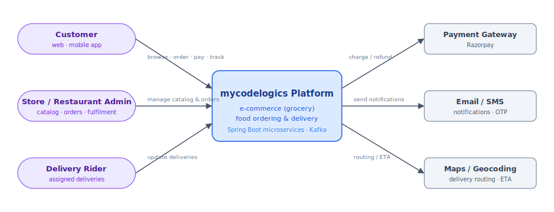
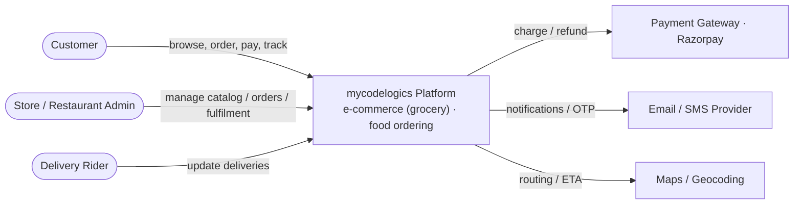
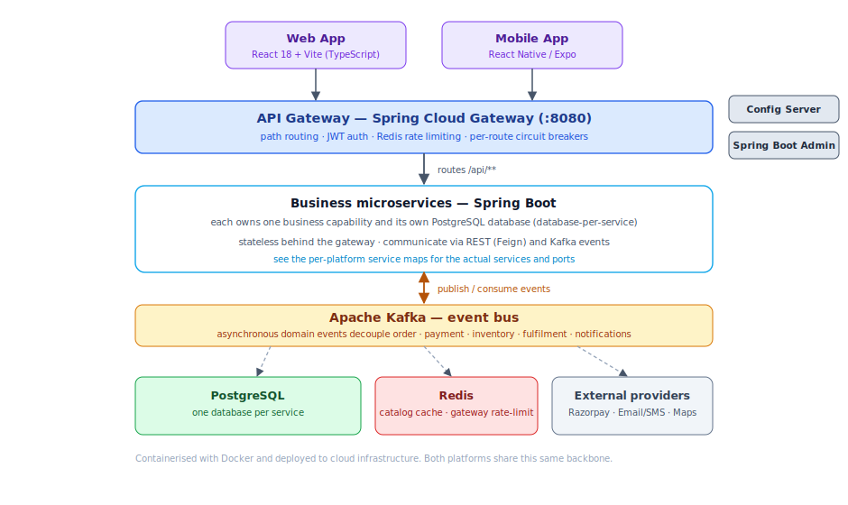
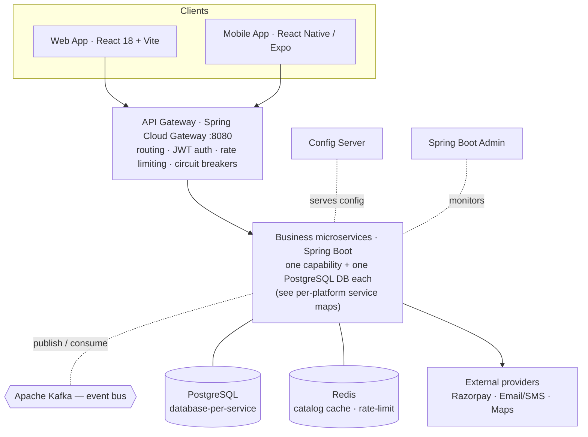

# System Overview

Both platforms — the online grocery **e-commerce** store and the **food-ordering & delivery** app — share the
same cloud-native, event-driven microservices backbone. Clients talk only to an **API Gateway**, which
authenticates requests (JWT) and routes them to the responsible service. Services communicate **synchronously
over REST (Feign)** for request/response needs and **asynchronously over Apache Kafka** for domain events. Each
service owns its **own PostgreSQL database** (database-per-service).

## Context

Diagram source (Mermaid)

## Microservices backbone

Diagram source (Mermaid)

The backbone is deliberately shown at the pattern level; the **actual services, ports and events** for each
platform are documented in their service maps:
[E-commerce](ecommerce-architecture.md) · [Food ordering](food-ordering-architecture.md).

## Why this shape

- **Single entry point.** The gateway centralises cross-cutting concerns — authentication, routing, Redis-backed
  rate limiting and per-route circuit breaking — so individual services stay focused on business logic.
- **REST where it must be synchronous** (e.g. reading the catalog, reserving stock at checkout), **events where
  it should be asynchronous** (e.g. an order emitting `order-placed`, which payment, shipping and customer
  services react to independently and in parallel).
- **Database-per-service.** No shared schema; services stay independently deployable and cross-service data is
  referenced by ID only, never by a cross-database join.
- **Stateless services** behind the gateway scale horizontally; **Redis** backs the product-catalog cache and
  gateway rate-limiting, and **Kafka** absorbs load spikes so a slow downstream service never blocks intake.
- **Containerised with Docker** and deployed to cloud infrastructure, with **Config Server** supplying
  centralised configuration and **Spring Boot Admin** providing health and metrics monitoring.
