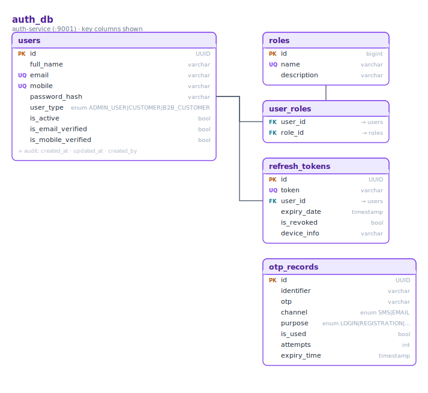
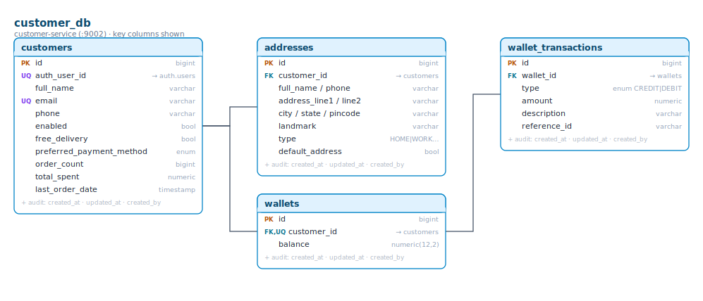
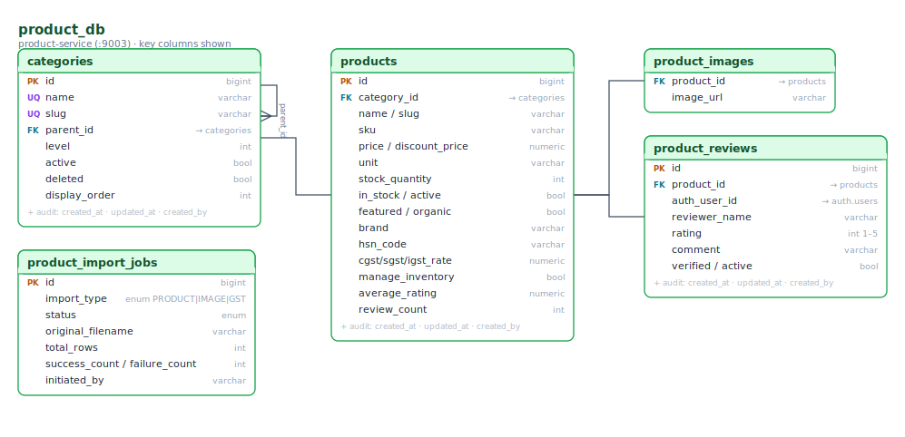
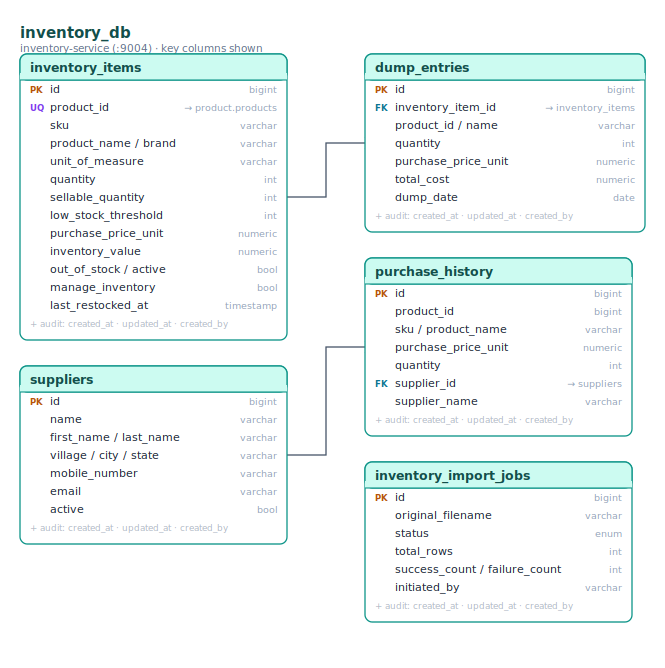
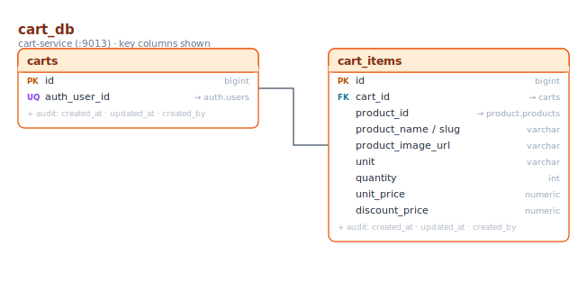
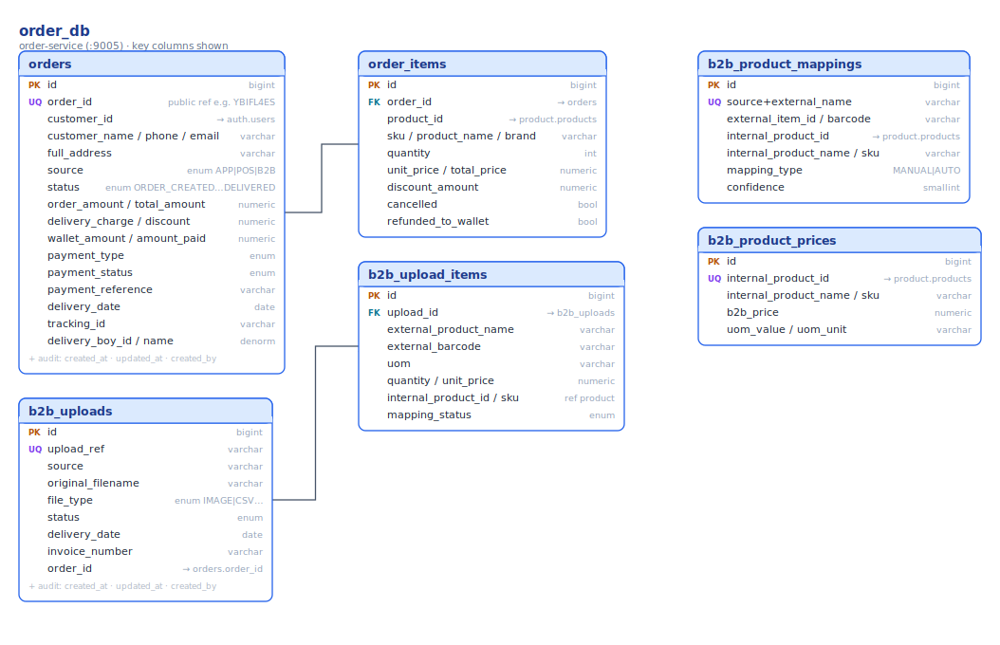
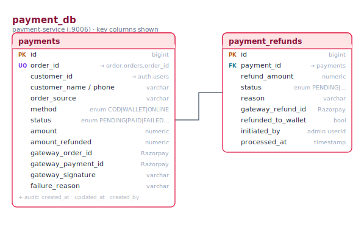
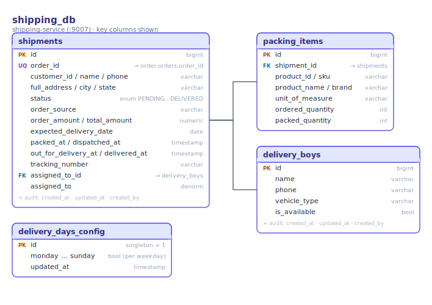
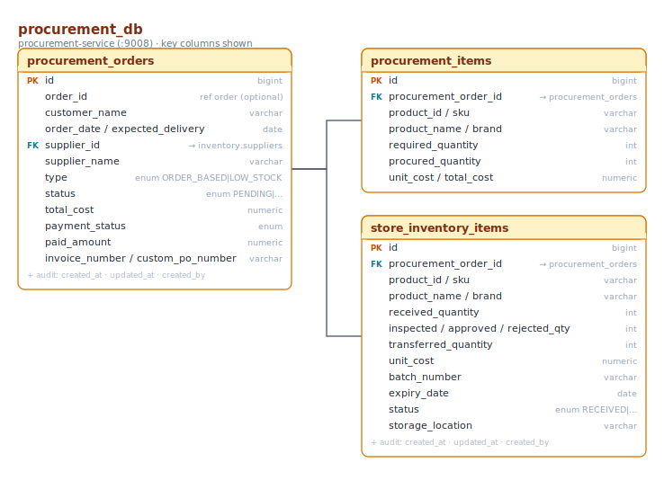
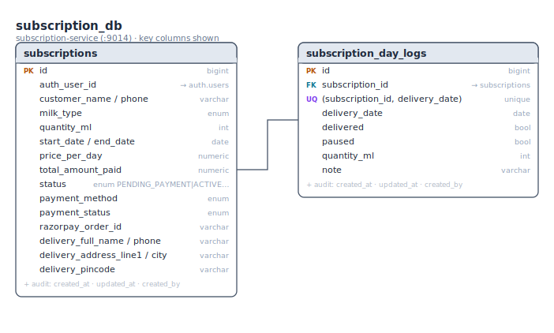

# E-commerce — Data Model

The e-commerce backend uses **database-per-service**: every service owns a private PostgreSQL database and no
service reads another service's tables. Wherever a row needs to point at data owned by another service, it stores
that owner's **ID only** (shown below as `→ <service>.<table>`) and never a real foreign key across databases.

Each diagram below is generated directly from the service's JPA `@Entity` classes (key columns shown; every
`extends BaseEntity` table also carries `created_at`, `updated_at`, `created_by`, `updated_by`). Badge legend:
**PK** primary key · **FK** foreign key (within the same DB) · **UQ** unique.

The ten business databases are `auth_db`, `customer_db`, `product_db`, `inventory_db`, `cart_db`, `order_db`,
`payment_db`, `shipping_db`, `procurement_db`, `subscription_db`.

---

## auth_db — auth-service (:9001)

Identity and access. `users` (UUID PK) holds credentials and verification flags and maps many-to-many to `roles`
through the `user_roles` join table. `refresh_tokens` and `otp_records` support JWT refresh/logout and OTP-based
login, registration and password reset. `user_type` distinguishes `ADMIN_USER`, `CUSTOMER` and `B2B_CUSTOMER`.

---

## customer_db — customer-service (:9002)

Customer profiles, addresses and the store wallet. `customers.auth_user_id` references `auth_db.users` (the
profile is created from the `user-registered` event). Each customer has many `addresses`, one `wallet`
(one-to-one), and every wallet credit/debit is recorded as a `wallet_transactions` row.

---

## product_db — product-service (:9003)

Catalog. `categories` is self-referential (`parent_id`) to form the category tree; `products` belong to a
category and carry pricing, GST (`hsn_code`, `cgst/sgst/igst_rate`), rating rollups and the `manage_inventory`
flag. `product_images` is an image collection, `product_reviews` are keyed to a reviewer via `auth_user_id`
(→ `auth_db.users`), and `product_import_jobs` tracks bulk/GST import runs.

---

## inventory_db — inventory-service (:9004)

Sellable stock and sourcing. `inventory_items` is keyed one-to-one to a catalog product (`product_id` →
`product_db.products`) and tracks `quantity` vs `sellable_quantity` against a `low_stock_threshold`. `suppliers`
and `purchase_history` hold sourcing and purchase-price history, `dump_entries` records written-off stock, and
`inventory_import_jobs` tracks stock imports.

---

## cart_db — cart-service (:9013)

One `carts` row per signed-in user (`auth_user_id` → `auth_db.users`) with its `cart_items`. Item rows snapshot
the product name, image, unit and price (looked up from product-service) so the cart renders without a live
catalog call.

---

## order_db — order-service (:9005)

Orders and B2B intake. An `orders` row carries a public `order_id`, a denormalized address and customer snapshot,
money fields, `status` (`ORDER_CREATED … DELIVERED`) and `payment_status`; its lines are `order_items`. The
`customer_id` references `auth_db.users` and each `product_id` references `product_db.products` (IDs only). The
B2B side (`b2b_uploads` → `b2b_upload_items`, plus the `b2b_product_mappings` and `b2b_product_prices` reference
tables) ingests external order files and maps them onto internal products before creating an order.

---

## payment_db — payment-service (:9006)

One `payments` row per order (`order_id` → `order_db.orders`), with `method` (`COD` / `WALLET` / `ONLINE`),
`status`, and Razorpay gateway identifiers. Refunds are tracked as `payment_refunds` rows against the payment,
optionally credited back to the customer's wallet.

---

## shipping_db — shipping-service (:9007)

One `shipments` row per order (`order_id` → `order_db.orders`) with an address snapshot, the fulfilment
timestamps (`packed_at`, `dispatched_at`, `out_for_delivery_at`, `delivered_at`) and `status`. `packing_items`
are the pick/pack lines; `delivery_boys` is the rider roster (a shipment is `assigned_to_id` a rider), and
`delivery_days_config` is a single-row table of enabled weekdays.

---

## procurement_db — procurement-service (:9008)

Purchase orders to suppliers. A `procurement_orders` row (`supplier_id` → `inventory_db.suppliers`) is either
`ORDER_BASED` or auto-created `LOW_STOCK`; its `procurement_items` are what was ordered. Received goods land as
`store_inventory_items` and move through inspection (`received → inspected → approved/rejected → transferred`)
before being transferred into sellable inventory.

---

## subscription_db — subscription-service (:9014)

Recurring milk subscriptions. A `subscriptions` row (`auth_user_id` → `auth_db.users`) holds the plan
(`milk_type`, `quantity_ml`, date range, `price_per_day`), payment fields and a delivery-address snapshot.
`subscription_day_logs` is one row per delivery day (unique on `subscription_id + delivery_date`) recording
delivered/paused status.

