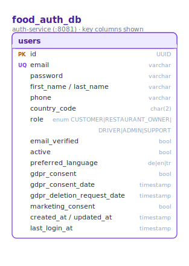
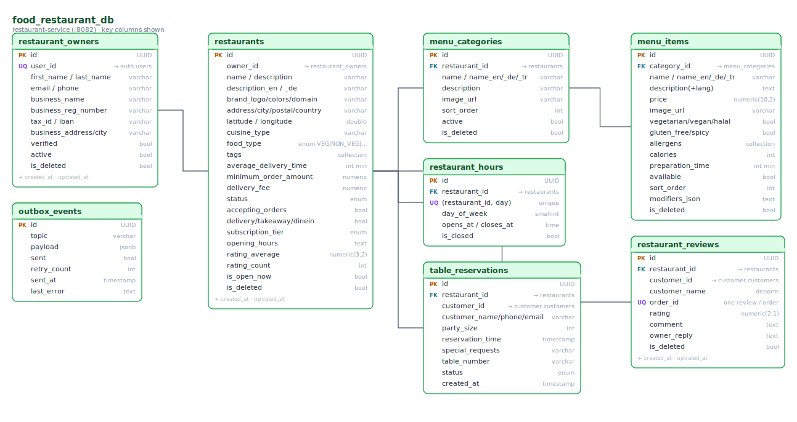
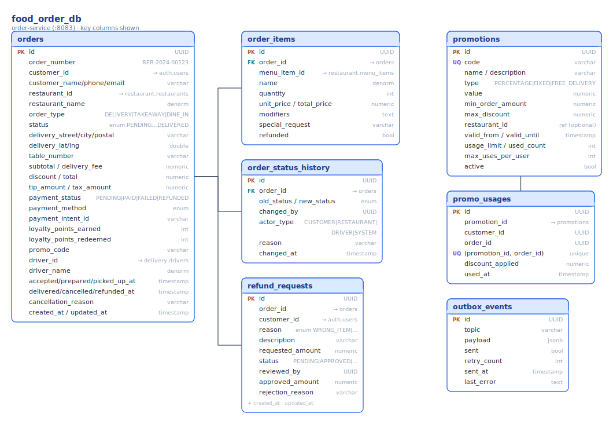
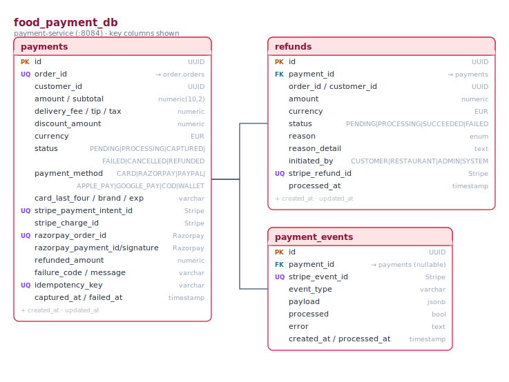
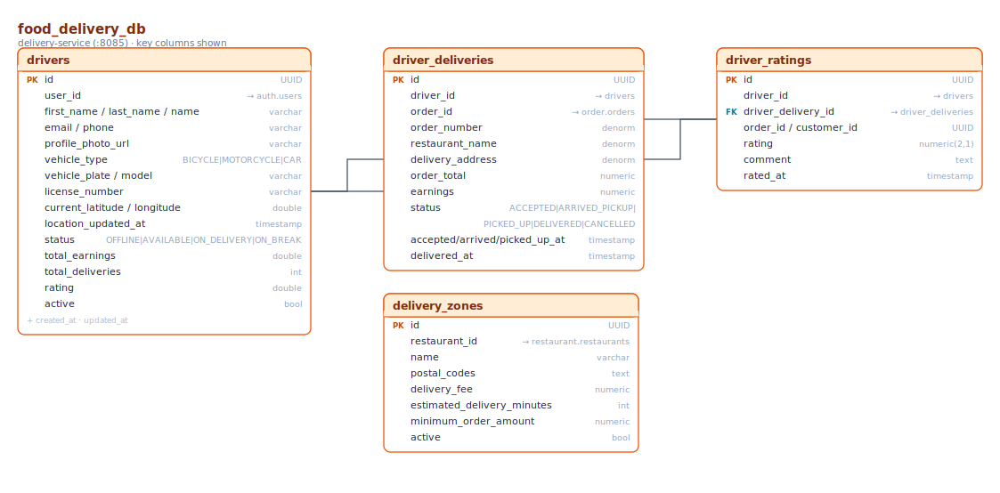
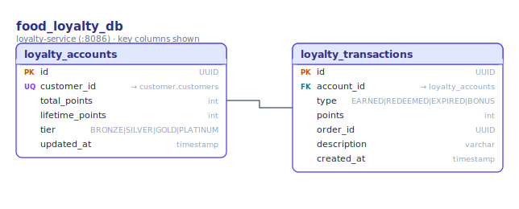
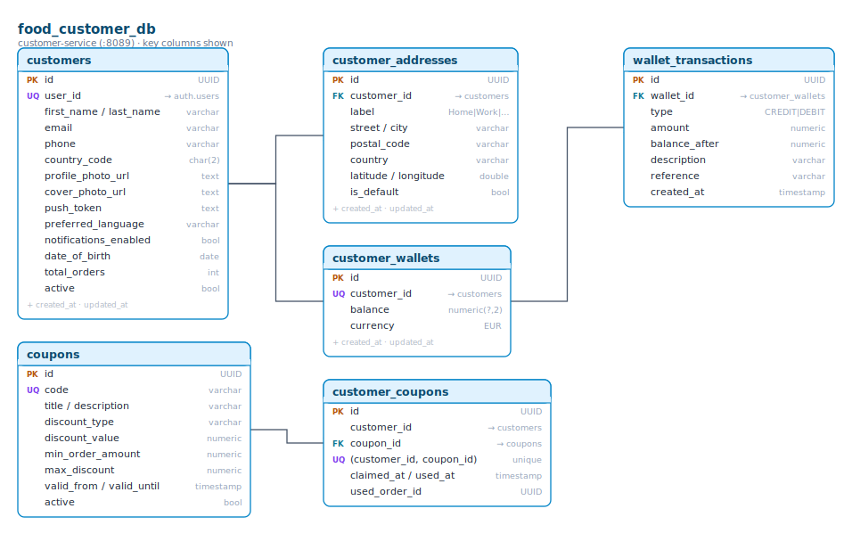

# Food Ordering — Data Model

The food-ordering backend uses **database-per-service**: every service owns a private PostgreSQL database and
no service reads another service's tables. Wherever a row needs to point at data owned by another service, it
stores that owner's **ID only** (shown below as `→ <service>.<table>`) and never a real foreign key across
databases.

Each diagram is generated directly from the service's JPA `@Entity` classes (key columns shown). Unlike the
e-commerce platform there is no shared `BaseEntity`; each entity carries its own timestamp columns, noted as
`+ created_at · updated_at` where present. Badge legend: **PK** primary key · **FK** foreign key (within the
same DB) · **UQ** unique. Primary keys are **UUID**s throughout.

The seven SQL databases are `food_auth_db`, `food_restaurant_db`, `food_order_db`, `food_payment_db`,
`food_delivery_db`, `food_loyalty_db` and `food_customer_db`. Two services hold **no database of their own**:
`cart-service` keeps carts in **Redis**, and `kitchen-service` and `notification-service` are stateless
(they react to events and REST calls and push over WebSocket / email).

---

## food_auth_db — auth-service (:8081)

Identity and access for every actor. A single `users` table (UUID PK) holds credentials, the `role`
(`CUSTOMER`, `RESTAURANT_OWNER`, `DRIVER`, `ADMIN`, `SUPPORT`), verification and GDPR/marketing-consent flags,
and the `preferred_language` (`de` / `en` / `tr`). On registration auth-service publishes `food.user.registered`;
the customer, restaurant and delivery services each create their own profile row from that event according to the
role. The downstream profile tables (`customers`, `restaurant_owners`, `drivers`) reference `users.id` by ID only.

---

## food_restaurant_db — restaurant-service (:8082)

Restaurants, owners, menus and reservations. A `restaurant_owners` row is created from the `user-registered`
event (`user_id` → `auth_db.users`); each owner has many `restaurants`. A restaurant carries branding, address
and geo-coordinates, `food_type`, delivery/takeaway/dine-in toggles, a `subscription_tier`, and rating rollups.
Its menu is `menu_categories` → `menu_items` (both multilingual via `name_en/_de/_tr`, items carry dietary flags,
allergens and a `modifiers_json`). `restaurant_hours` is the weekly opening schedule (unique per
`restaurant_id + day_of_week`), `restaurant_reviews` are keyed one-per-`order_id` (UNIQUE), and
`table_reservations` handles dine-in bookings. `outbox_events` is the transactional-outbox table this service
uses to publish domain events reliably.

---

## food_order_db — order-service (:8083)

Orders and their lifecycle. An `orders` row carries a human-readable `order_number`, denormalized customer,
restaurant and delivery-address snapshots, money fields (`subtotal`, `delivery_fee`, `discount`, `tip_amount`,
`tax_amount`, `total`), the `order_type` (`DELIVERY` / `TAKEAWAY` / `DINE_IN`), the `status`
(`PENDING → CONFIRMED → PREPARING → READY_FOR_PICKUP → OUT_FOR_DELIVERY → DELIVERED`, plus `CANCELLED` /
`REFUNDED`) and a separate `payment_status`. Its lines are `order_items` (`menu_item_id` →
`restaurant_db.menu_items`), and every transition is appended to `order_status_history` with the `actor_type`
that made it. `promotions` and `promo_usages` (unique per `promotion_id + order_id`) handle discount codes, and
`refund_requests` captures customer-raised refunds routed to admin review. `customer_id`/`driver_id` are ID
references to `auth_db.users` / `delivery_db.drivers`. This service also uses an `outbox_events` table for
reliable event publishing.

---

## food_payment_db — payment-service (:8084)

Payments, refunds and gateway webhooks. One `payments` row per order (`order_id` → `order_db.orders`, UNIQUE)
records the amount breakdown, `currency` (EUR), `status` (`PENDING → PROCESSING → CAPTURED`, plus `FAILED` /
`CANCELLED` / `REFUNDED`) and `payment_method` (`CARD`, `RAZORPAY`, `PAYPAL`, `APPLE_PAY`, `GOOGLE_PAY`,
`CASH_ON_DELIVERY`, `WALLET`). The platform integrates **two gateways** — Stripe (`stripe_payment_intent_id`,
`stripe_charge_id`) and Razorpay (`razorpay_order_id`, `razorpay_payment_id`, `razorpay_signature`) — and an
`idempotency_key` guards against duplicate charges. `refunds` are tracked against a payment, and `payment_events`
stores raw gateway webhook events (unique `stripe_event_id`) for idempotent processing. This is a distinct
implementation from the e-commerce payment service (which is Razorpay-only).

---

## food_delivery_db — delivery-service (:8085)

Drivers and delivery trips. A `drivers` row is created from the `user-registered` event when the role is
`DRIVER` (`user_id` → `auth_db.users`); it holds vehicle details, live location (`current_latitude/longitude`,
`location_updated_at`), a `status` (`OFFLINE` / `AVAILABLE` / `ON_DELIVERY` / `ON_BREAK`) and earnings/rating
rollups. Each accepted trip is a `driver_deliveries` row (`order_id` → `order_db.orders`) moving through
`ACCEPTED → ARRIVED_PICKUP → PICKED_UP → DELIVERED`; `driver_ratings` captures a customer's rating of a
completed trip; and `delivery_zones` defines per-restaurant delivery areas, fees and minimum order amounts.
Driver assignment and status changes are forwarded to order-service over REST (order-service stays the source
of truth for the order itself).

---

## food_loyalty_db — loyalty-service (:8086)

Points and tiers. One `loyalty_accounts` row per customer (`customer_id` → `customer_db.customers`, UNIQUE)
tracks `total_points`, `lifetime_points` and the derived `tier` (`BRONZE` / `SILVER` / `GOLD` / `PLATINUM`).
Every change is a `loyalty_transactions` row (`EARNED` / `REDEEMED` / `EXPIRED` / `BONUS`) linked back to the
`order_id`. Points are awarded when the service consumes `food.order.delivered` and deducted when it consumes
`food.order.items.refunded`.

---

## food_customer_db — customer-service (:8089)

Customer profiles, addresses, wallet and coupons. A `customers` row is auto-created from the `user-registered`
event (`user_id` → `auth_db.users`) and holds profile photos, push token, language and an order counter. Each
customer has many `customer_addresses` (with geo-coordinates and a default flag), one `customer_wallets` row
(one-to-one, `customer_id` UNIQUE) whose every credit/debit is a `wallet_transactions` row, and can claim
`coupons` through the `customer_coupons` join (unique per `customer_id + coupon_id`). Wallet top-ups are credited
when the service consumes `food.wallet.topup.success` from payment-service.

---

## cart — cart-service (:8091, Redis)

Cart-service has **no SQL database**. A customer's `Cart` (and its `CartItem`s) live in **Redis**, keyed by the
signed-in user's ID. Item rows snapshot the `menu_item_id`, name, `unit_price`, quantity and the owning
`restaurant_id` / `restaurant_name` supplied by the client, so the cart renders without a live call to
restaurant-service; adding an item from a different restaurant clears the cart automatically.

---

> Diagrams are regenerated from the JPA entities, so they stay in step with the code. Cross-database arrows
> (`→ <service>.<table>`) are ID references resolved in application code or via events — never SQL joins across
> service databases.
