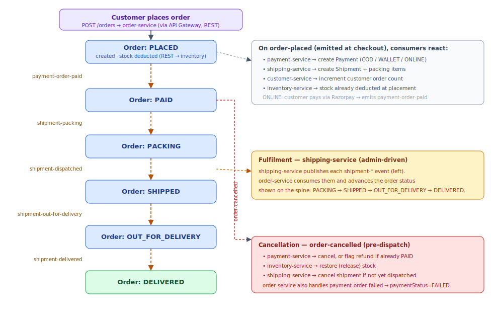
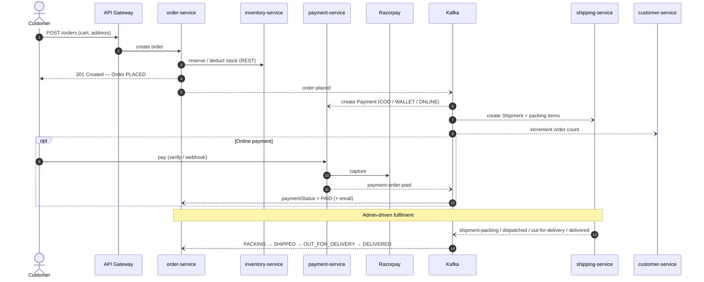

# E-commerce — Checkout & Fulfilment

How an order flows from checkout through payment and fulfilment. The order is created synchronously and stock
is deducted at placement (order-service → inventory over REST). Everything after that is **choreographed with
Kafka events**: order-service, payment-service, shipping-service and customer-service each react to events and
update only their own data, so intake never blocks on a slow consumer.

The order status itself is advanced entirely by events — `payment-order-paid` from payment-service, then the
`shipment-*` events from shipping-service.

## Flow

Diagram source (Mermaid sequence)

## What happens at each step

1. **Checkout.** The customer posts an order through the gateway; order-service creates the `Order` (status
   `PLACED`) and deducts stock synchronously via `POST /inventory/reserve`.
2. **`order-placed` fan-out.** payment-service creates a `Payment` (COD / WALLET / ONLINE), shipping-service
   creates a `Shipment` with packing items, and customer-service increments the customer's order count.
3. **Payment (online).** The customer pays via Razorpay; payment-service verifies and publishes
   `payment-order-paid`, which order-service consumes to set `paymentStatus = PAID` and email the customer.
4. **Fulfilment.** As staff pack and dispatch, shipping-service publishes `shipment-packing`,
   `shipment-dispatched`, `shipment-out-for-delivery` and `shipment-delivered`; order-service consumes each and
   advances the order status to `PACKING → SHIPPED → OUT_FOR_DELIVERY → DELIVERED`.

## Failure & compensation

- **Payment fails** → payment-service publishes `payment-order-failed` → order-service sets
  `paymentStatus = FAILED` and emails the customer.
- **Order cancelled (pre-dispatch)** → order-service publishes `order-cancelled` → payment-service cancels the
  payment (or flags a refund if already `PAID`), inventory-service restores the stock, and shipping-service
  cancels the shipment if it has not yet been dispatched.
