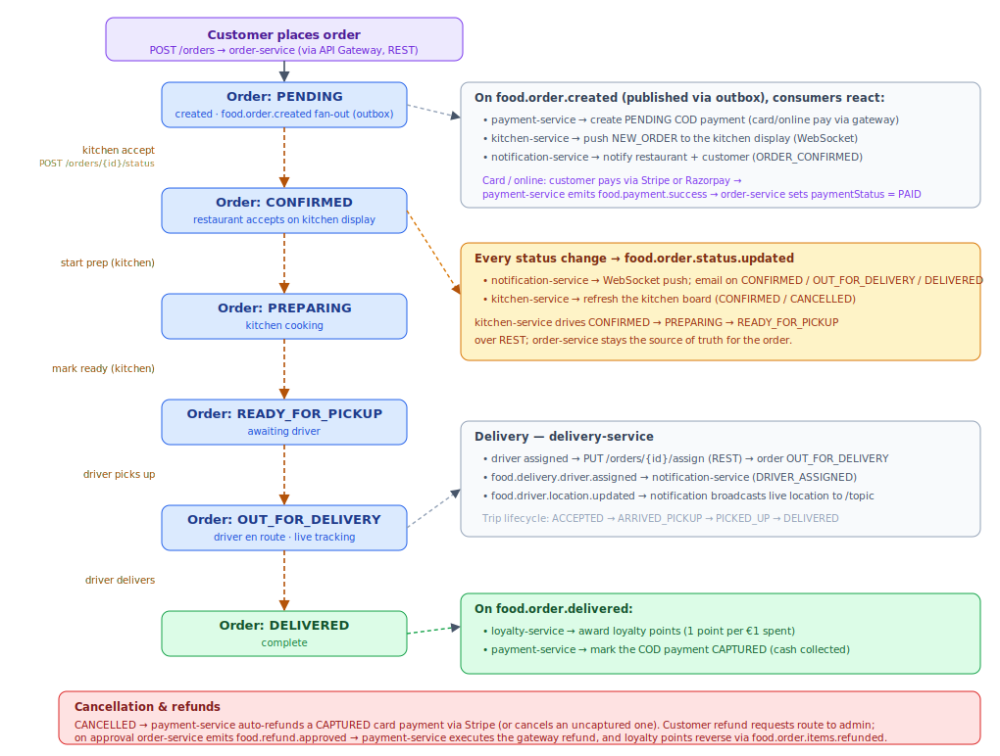

# Food Ordering — Order to Delivery

How an order flows from checkout to delivery. The order is created synchronously (`POST /orders`) and
`order-service` remains the **source of truth** for its status. Everything around it is **choreographed with
Kafka events**: payment-service, kitchen-service, delivery-service, notification-service and loyalty-service
each react to events and update only their own data, so order intake never blocks on a slow consumer.

The two status hops that need an immediate answer happen over **REST** — kitchen-service advances the order as
the restaurant accepts and cooks, and delivery-service attaches the driver — while the customer-facing status
stream (`food.order.status.updated`) drives near-real-time WebSocket and email updates.

## Flow



<details>
<summary>Diagram source (Mermaid sequence)</summary>

```mermaid
sequenceDiagram
    autonumber
    actor C as Customer
    participant GW as API Gateway
    participant ORD as order-service
    participant PAY as payment-service
    participant GWY as Stripe / Razorpay
    participant K as Kafka
    participant KIT as kitchen-service
    actor R as Restaurant
    participant DEL as delivery-service
    participant NOTIF as notification-service
    participant LOY as loyalty-service

    C->>GW: POST /orders (restaurant, items, address)
    GW->>ORD: create order
    ORD-->>C: 201 Created — Order PENDING
    ORD--)K: food.order.created (via outbox)

    K--)PAY: create PENDING COD payment (card/online pay via gateway)
    K--)KIT: WebSocket NEW_ORDER to kitchen display
    K--)NOTIF: notify restaurant + customer

    opt Card / online payment
        C->>PAY: pay (Stripe intent / Razorpay verify / webhook)
        PAY->>GWY: capture
        PAY--)K: food.payment.success
        K--)ORD: paymentStatus = PAID
    end

    R->>KIT: accept / prepare / ready
    KIT->>ORD: POST /orders/{id}/status (REST)
    Note over ORD,NOTIF: each change → food.order.status.updated<br/>→ WS push + email; kitchen board refresh

    DEL->>ORD: PUT /orders/{id}/assign (REST) — OUT_FOR_DELIVERY
    DEL--)K: food.delivery.driver.assigned / food.driver.location.updated
    K--)NOTIF: driver assigned + live location

    ORD--)K: food.order.delivered
    K--)LOY: award loyalty points
    K--)PAY: mark COD payment CAPTURED
    K--)NOTIF: delivered confirmation (email)
```

</details>

## What happens at each step

1. **Checkout.** The customer posts an order through the gateway; order-service creates the `Order` (status
   `PENDING`), records the initial status history, and publishes `food.order.created` through its transactional
   **outbox**.
2. **`food.order.created` fan-out.** payment-service creates a **pending COD** payment record when the method is
   cash-on-delivery (card/online orders pay through the gateway instead); kitchen-service pushes a `NEW_ORDER`
   card to the restaurant's display over WebSocket; and notification-service notifies the restaurant and the customer.
3. **Payment (card / online).** The customer pays via **Stripe or Razorpay**; on capture, payment-service
   publishes `food.payment.success`, which order-service consumes to set `paymentStatus = PAID` (idempotent).
4. **Kitchen (REST).** As the restaurant accepts and cooks on the kitchen display, kitchen-service calls
   `POST /orders/{id}/status`, advancing the order `CONFIRMED → PREPARING → READY_FOR_PICKUP`. order-service
   stays the source of truth.
5. **Status choreography.** Every transition publishes `food.order.status.updated`; notification-service pushes
   a WebSocket update to the customer and emails on `CONFIRMED` / `OUT_FOR_DELIVERY` / `DELIVERED`, and
   kitchen-service refreshes the board on `CONFIRMED` / `CANCELLED`.
6. **Delivery.** delivery-service assigns a driver with `PUT /orders/{id}/assign` (moving the order to
   `OUT_FOR_DELIVERY`) and publishes `food.delivery.driver.assigned` and `food.driver.location.updated`, which
   notification-service turns into a driver-assigned push and live location on the order-tracking topic.
7. **Delivered.** On `DELIVERED`, order-service publishes `food.order.delivered`; loyalty-service awards points
   (1 point per €1 spent) and payment-service marks a COD payment `CAPTURED`.

## Failure & compensation

- **Order cancelled** → `food.order.status.updated` with `newStatus = CANCELLED` → payment-service
  auto-refunds a card payment that was already `CAPTURED` (via Stripe) or simply cancels one still `PENDING` /
  `PROCESSING`. A COD order already delivered is left for a manual refund request.
- **Customer refund request** → order-service records a `RefundRequest` routed to admin; on approval it emits
  `food.refund.approved` → payment-service executes the gateway refund, and `food.order.items.refunded` reverses
  the loyalty points in loyalty-service.
